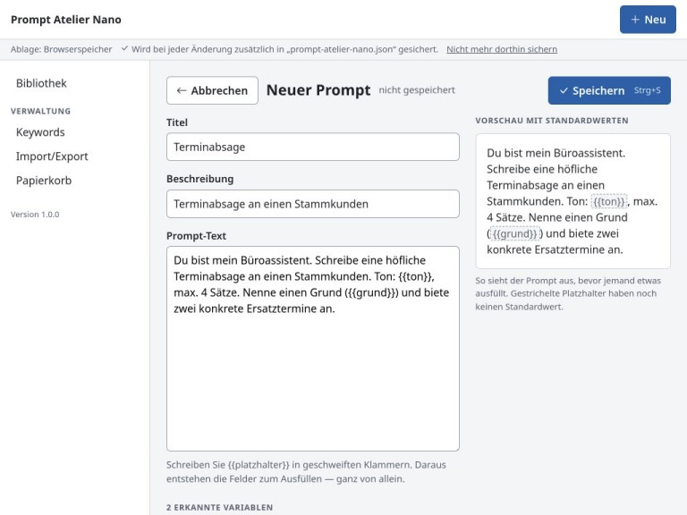
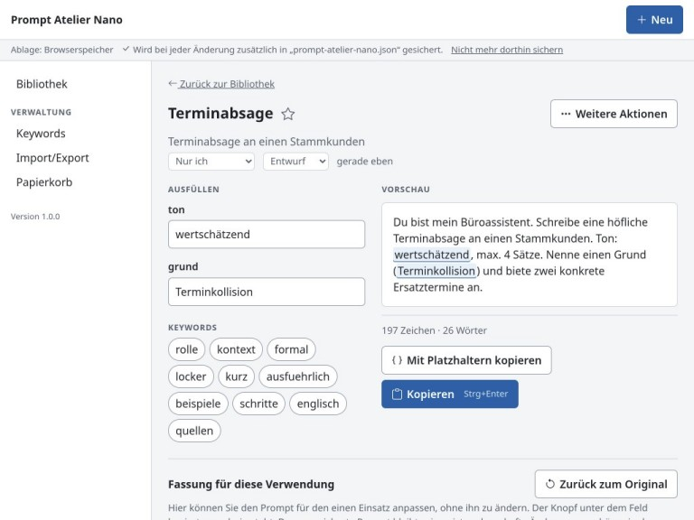
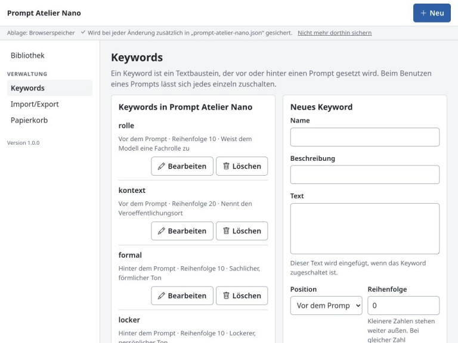
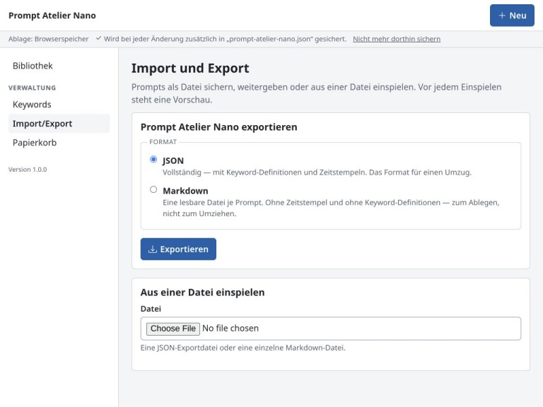
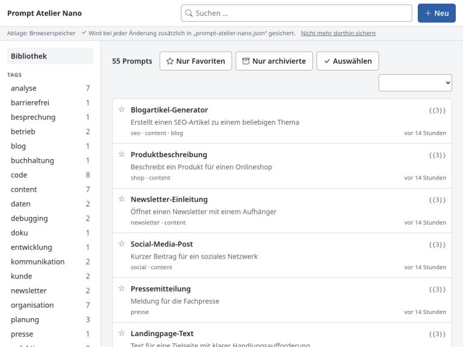

**English** · [Deutsch](README.de.md)

# Prompt Atelier Nano

Prompt Atelier as a single HTML file. No server, no database, no installation.

The full application needs Ruby and a web server. On many workstations neither is
available, and starting a local server is not permitted. Prompt Atelier Nano is
built for that case. One file is copied onto the machine and opened by double
click. Everything runs inside the browser.

```
find a prompt  →  fill in the fields  →  check the preview  →  copy
```

Prompts can be exchanged with the full application in both directions. The file
format is the same.

---

## Screenshots

| | |
|---|---|
|  |   |
|  |  |
|  | |

---

## Features

| Area | Description |
|---|---|
| Library | Full text search across title, description, body and tags. Spelling variants are resolved, so `Größe` is found by typing `groesse` or `grosse` |
| Variables | Placeholders in double curly braces become form fields with a default value, a required flag and a list of options |
| Live preview | The finished text is assembled as you type. Nano and the full application produce the same result, character for character |
| Keywords | Reusable blocks of text placed before or after a prompt |
| Tags | The only means of order. There are no folders and no workspaces |
| Change history | Trash with 30 days of retention, and undo of the last change |
| Import and export | JSON and Markdown, and JSON is lossless in both directions |
| Backup to disk | The collection can be written into a file of your choosing on every change |
| Interface languages | German, English, French, Italian, Spanish |

There is no sign-in, no user account and no administration. The application makes
no network request of any kind.

---

## Requirements

| Item | Requirement |
|---|---|
| Browser | A current Chromium, Edge, Firefox or Safari. See below |
| Disk space | About 440 kB for the file |
| Anything else | None. No Ruby, no Node.js, no installation, no network connection |

The application is designed for collections of up to 500 prompts.

It is tested on Chromium 151, Firefox 153, WebKit 605 and Microsoft Edge 151.
Older releases are likely to work and have not been tried, so no minimum is
claimed here.

What a given machine actually grants is detected at start and shown in the
interface, because a policy can switch browser storage off. See
[doc/installation.md](doc/installation.md), chapter 4.

---

## Getting started

Download `prompt-atelier-nano-<version>.zip` from the
[releases page](https://github.com/form1c/prompt-atelier-nano/releases), or take
the HTML file out of it and pass that on by itself. The application needs nothing
else from the archive.

1. Copy `prompt-atelier-nano.html` onto the machine, into a folder that is
   backed up.
2. Open it by double click.
3. Answer the one question on the first start. It asks whether to begin with 55
   example prompts or with an empty collection.

> **Important:** your prompts live in the storage of your browser, not in the
> HTML file. Clearing the browser data removes them. Read chapter 1 of the user
> manual before you start working.

---

## Documentation

| Document | Reader |
|---|---|
| [doc/manual.md](doc/manual.md) | Anyone using the application |
| [doc/installation.md](doc/installation.md) | Anyone handing it out or putting it on a share |
| [doc/development.md](doc/development.md) | Anyone working on the source |

Each document exists in German as well, with the suffix `.de.md`.

---

## Technical outline

The application is a Vue 3 interface. In the full application it talks to a Ruby
backend over HTTP. Here the same interface talks to a local dispatcher that
answers the identical calls from a collection held in the browser. Of the 49
files taken from the full application, 41 are used unchanged.

The build produces one file. Script, styles, icons, translations and example data
are folded into the HTML, because a browser opening a file from a folder refuses
to load neighbouring files. A content security policy without `unsafe-inline` is
kept by naming each embedded block by its hash.

Storage is chosen at start by trying, not by asking. IndexedDB is preferred, then
`localStorage`, and failing both the application runs in memory and says so
without pause.

Details are in [doc/development.md](doc/development.md).

---

## License

MIT. See [LICENSE](LICENSE.md).

Prompt Atelier Nano is derived from Prompt Atelier and shares a large part of its
source. The version it was built from is shown at the foot of the sidebar.
